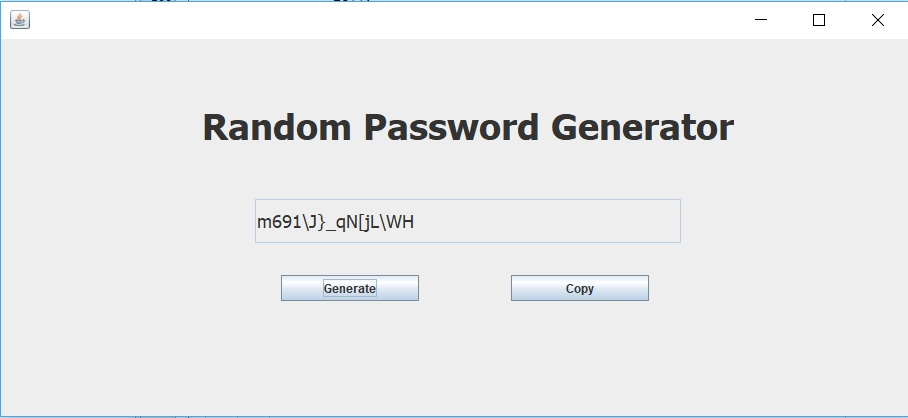

# Random-Password-Generator

## Objective: Design and Develop a GUI program which generates a random password.

We have used JAVA with NETBEANS IDE for generating random passwords using self made Pseudo-Random Function and Providing Graphical Interface.

### Graphical Interface

**IF YOU ENCOUNTER ANY BUGS OR FOR ANY SUGGESTIONS REGARDING THE IMPROVEMENT OF THE RANDOM PASSOWORD GENERATOR FEEL FREE TO CONTACT ME:**

Shivang Srivastava	-	shivang.8@geu.ac.in 
